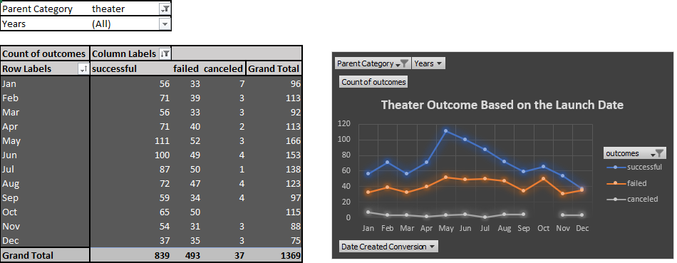
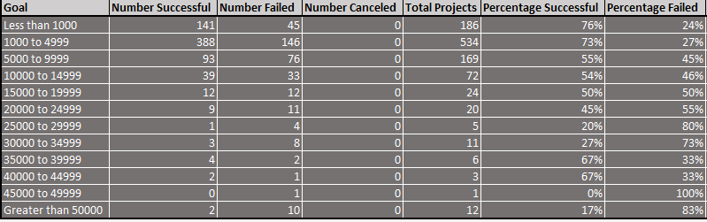

# Kickstarting with Excel

## Overview of Project

   This project is for Louise, who wants to start a crowdfunding campaign. She needs help with funding her play, Fever. She's estimating a budget of over
   $10000. We organized and visualized the data of similar campaigns in order to reveal trends to Louise, so that she can make the right decision towards 
   success
  
 
## Analysis and Challenges

##### Analysis
   This analysis was performed on several crowdfunding projects to determine the trends. We have used the excel application for the analysis. Since Louise is 
   interested in starting a campaign for Theater(play being the sub category for the parent category theater), the analysis was carried out filtering the data
   of the theatre category. The dataset was organized, sorted, analyzed, and visualized to determine if there are specific factors that makes a project campaign
   successful. We used advanced visualization in excel by integrating pivot tables and charts to enhance the analysis and give a report based on the data.
  
##### Challenges
   The dataset had to be organized, filtered, and sorted so that it could be easily understood and provide a proper insight that will be helpful in the 
   project. There were some columns which were not in the readable format. These columns were to be converted into readble data by applying the advanced excel
   formulas. Some new columns had to created by splitting a single column to have additional data for our analysis.

## Results

###### What are two conclusions you can draw about the Outcomes based on Launch Date?

   - The best time to launch the campaign is May as it has the maximum successful campaigns
   - All months had alomost the same number of failed campiagns launched.
   
   

##### What can you conclude about the Outcomes based on Goals?
 
  - The success rate started dropping and failure rate went up as the goals increased. So, there is a need to put a cap on the price to ask/goals
  - The most successful goal category was 1000 to 4999 and the worst was between 45000 to 49999. It will make more sense if there are only a few goal 
    categories below and above 1000 to 4999. 
	
	
	
	
  
##### What are some limitations of this dataset?

  - The columns, "deadline" and "launched_at" are not in readable format. These columns contain Unix timestamps rather than dates in standard format
  - The "Category and Subcategory" column groups the main category with its subcategories. For a better analysis, it had to be split into two different 
    columns:"Parent Category" and "Subcategory"

##### What are some other possible tables and/or graphs that we could create?

    We could use statiscal components to deepen our analysis. Stastics provide an unbiased view of data and make decisions based on calculations rather than
    gut feelings. We could calculate the central tendency of the data and use the box and whiskers chart to identify the outliers. Upon calculating the mean 
	and median of the goals, it was ascertained that the median of the goals is lower than the mean of the goals. This indicated that there are outliers in
	the high end of the distribution.
 
    